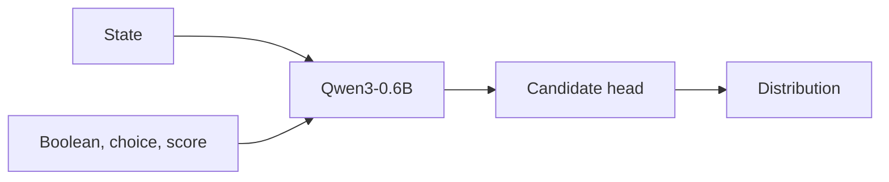

<p align="center">
  
</p>

<p align="center">
  <a href="README_zh.md"></a>
  <a href="LICENSE"></a>
  <a href="https://huggingface.co/aimeigaoshou/agent-jev"></a>
  <a href="https://huggingface.co/Qwen/Qwen3-0.6B"></a>
  <a href="https://huggingface.co/datasets/LocalLLaMA/typed-decisions"></a>
  
</p>

<p align="center">
  Weights: <a href="https://huggingface.co/aimeigaoshou/agent-jev">https://huggingface.co/aimeigaoshou/agent-jev</a>
</p>

<p align="center">
  <a href="#the-job">The job</a>
  &nbsp;&nbsp;·&nbsp;&nbsp;
  <a href="#primitives">Primitives</a>
  &nbsp;&nbsp;·&nbsp;&nbsp;
  <a href="#one-forward-pass">Forward pass</a>
  &nbsp;&nbsp;·&nbsp;&nbsp;
  <a href="#typed-decisions">Results</a>
  &nbsp;&nbsp;·&nbsp;&nbsp;
  <a href="#latency--throughput">Latency</a>
  &nbsp;&nbsp;·&nbsp;&nbsp;
  <a href="#run-it">Run it</a>
  &nbsp;&nbsp;·&nbsp;&nbsp;
  <a href="#http">HTTP</a>
  &nbsp;&nbsp;·&nbsp;&nbsp;
  <a href="#repository">Repository</a>
</p>

AgentJev-0.6B does not write. You hand it a state and questions you have already phrased. One forward pass returns a probability for every option. The number of decoded tokens is zero.

Put it where an agent loop needs a gate, a route, or a score. Leave the prose to a larger model.

---

## The job

A coding agent, a triage bot, or a workflow spends most of its steps on questions that are not writing problems. Did the tests pass. Which tool is next. Is this command safe to run. The usual answer is to ask a 27B–70B model to talk its way to a boolean, then parse the talk.

| | A writer, used as a switch | AgentJev |
| --- | --- | --- |
| Output | Text you hope is JSON | A distribution over options you supplied |
| Decode | One token at a time | None |
| Failure | A malformed object, or a confident sentence | A probability you can threshold |
| Place in the loop | The whole turn | The reflex under the turn |

<p align="center">
  
  <br>
  <sub>The state stays unstructured. The questions are typed. The answer is the distribution.</sub>
</p>

The state can be a diff, a stack trace, a ticket thread, or a table. Serialize an object and it is sent as stable JSON. Question ids exist so you can match the response. They are not shown to the model. The meaning has to live in the question and in the option text.

---

## Primitives

Three shapes. Every one of them returns the full distribution, not only the winner.

| | Boolean | Choice | Score |
| --- | --- | --- | --- |
| Ask | A proposition | Which of these, given exactly these options | Where on this ordered rubric |
| You send | Optional `criteria` for true and false | 2–255 options, each a description. A list or a map | 2–10 level descriptions, lowest first |
| You get back | `value`, `probability` of true, both masses | `value`, `top_probability`, `margin`, the full map | `level` (argmax), `score` = Σ i · Pᵢ |

`margin` is the gap between the best option and the second. Choice is a preference inside the set you passed. It is not an independent probability that the action will succeed. If you need that, ask a boolean per action and calibrate it on your own outcomes.

---

## One forward pass

The backbone is Qwen3-0.6B with the language-model head removed. Each candidate is read at its last token. A small permutation-equivariant head then scores the set: the order of options does not smuggle in a ranking. Softmax is per question.



Three properties are worth the implementation, not the slogan.

**Nothing is decoded.** Hidden states go to logits. There is no output vocabulary step, so there is no JSON to repair.

**The context is 2,048 tokens, and over-length input is refused.** A diff or a trace that does not fit is an error, not a silent crop of the question or a candidate.

**A shared prefix is reused across candidates of the same question.** On one fixed load — 64 choice options plus one boolean, 66 paths, 33,547 path tokens — the unshared median was **609.65 ms**. The shared-prefix path was **298.91 ms**. The largest probability difference was **0.000508**, and the chosen option did not change. Generated tokens were 0 either way. That figure is this load, measured after warmup, not a promise about every prompt.

<p align="center">
  
  <br>
  <sub>The state is encoded once. Candidates branch from that prefix.</sub>
</p>

Different questions do not yet share a state cache. A tree encoder exists as a seam in the training code. The serving path that was measured is the shared-prefix runtime above, not that seam.

---

## Typed Decisions

Official test split of [Typed Decisions](https://huggingface.co/datasets/LocalLLaMA/typed-decisions): **400 cases, 2,000 questions**, five questions over one state, four workflows. Accuracy is agreement with the public teacher argmax. It is not a measured coding-agent success rate.

| Model | Kind | Top-1 | Soft CE ↓ | Brier ↓ | ECE ↓ | Score MAE ↓ |
| --- | --- | ---: | ---: | ---: | ---: | ---: |
| **AgentJev-0.6B, this run** | Specialist | **79.25%** · 1585/2000 | **0.8494** | **0.0448** | 0.1687 | **0.2096** |
| Laya, published checkpoint | Specialist | 77.00% · 1540/2000 | 0.8844 | 0.0615 | 0.2170 | 0.2423 |
| TypeSafe Jev 1.13.0 | Generalist, zero-shot | 72.7% | — | 0.148 | 0.144 | 0.391 |
| ModernBERT-base, 149M | Specialist | 64.6% | — | 0.119 | 0.179 | 0.444 |
| MiniLM-L6, 22M | Specialist | 58.7% | — | 0.143 | 0.108 | 0.515 |
| AgentJev phase 4, before this run | Specialist | 38.70% · 774/2000 | 1.2817 | 0.2577 | 0.1050 | 0.7062 |
| Prior, label frequency | Reference | 47.0% | — | 0.189 | 0.088 | — |
| Uniform | Reference | 30.8% | — | 0.238 | 0.169 | — |

Rows without a soft-CE number are copied from the dataset card. They were not re-scored in this repository, and that card does not publish soft cross-entropy. Brier, ECE, and score MAE for those rows use the card's definitions.

Against Laya, on this split, the accuracy gap is **+2.25 points**. A case-level bootstrap over the 400 cases gives a 95% interval of **[+0.65, +3.90]**. Against the phase-4 weights this run started from, the gap is **+40.55 points**, interval **[+37.35, +43.50]**.

<p align="center">
  
  <br>
  <sub>The gap, counted in questions. Overall 1,585 against 1,540. Invoice 431 against 406. Customer service 411 against 382.</sub>
</p>

### By workflow

Five hundred questions each. AgentJev is the calibrated checkpoint. Laya is the same published specialist checkpoint as the table above.

| Workflow | AgentJev | Laya |
| --- | ---: | ---: |
| Invoice processing | **86.20%** | 81.20% |
| Customer service | **82.20%** | 76.40% |
| Security incidents | 76.80% | **77.60%** |
| Agent-trace observability | 71.80% | **72.80%** |

### By primitive

| Primitive | Questions | Top-1 | Soft CE |
| --- | ---: | ---: | ---: |
| Boolean | 600 | 88.83% | 0.4935 |
| Choice | 600 | 75.33% | 0.9767 |
| Score | 800 | 75.00% | 1.0209 |

### How to read the table

Specialist and generalist are not the same measurement. The dataset card says so, and the table marks it. Jev 1.13.0 answered these schemas zero-shot. AgentJev, Laya, ModernBERT, and MiniLM were fit on this benchmark.

Laya's published checkpoint trained on all 1,200 official training cases. This run held out 120 development cases and 120 calibration cases, and selected the step-600 checkpoint by development soft cross-entropy **before** the test split was opened. Temperature is one positive scalar per primitive, fit only on the calibration cases. The loss was soft cross-entropy plus 0.1 times sum-of-candidates Brier. Seed `20260921`. Dataset revision `ea9306458d6e9563628369a3d1e72e362fb381d2`.

Targets are teacher distributions, including synthetic cases. Beating a row here does not mean a pull request merged, an incident was contained, or an invoice was paid.

Full numbers: [`typed_decisions/comparison.json`](typed_decisions/comparison.json), [`typed_decisions/protocol.json`](typed_decisions/protocol.json), [`typed_decisions/REPORT_zh.md`](typed_decisions/REPORT_zh.md).

---

## Latency & throughput

The trade-off against Laya is clear: Laya is smaller on single short questions; AgentJev scales under wide candidate sets.

| Load | Laya (421M, ModernBERT) | AgentJev (598M, Qwen3) | Difference |
|---|---:|---:|---|
| **P50 case latency** (5 questions over 1 state, test split) | **41.53 ms** | ~60–70 ms | Laya is ~20 ms faster on short inputs; its encoder has 177M fewer parameters |
| **P90 case latency** (5 questions over 1 state) | **47.14 ms** | ~85 ms | Both well within interactive response budgets |
| **Wide candidate load** (64 Choice + 1 Boolean, 33k tokens) | ~500–600 ms *(repeated forward)* | **298.91 ms** *(shared prefix)* | **AgentJev is ~2x faster** via KV prefix reuse |
| **Context ceiling** | 1,024 tokens | **2,048 tokens** | Laya truncates or refuses beyond 1,024; AgentJev retains twice the state |

Laya's ModernBERT backbone has no causal prefix seam: each candidate in a 64-option question requires a complete forward pass over the state text. AgentJev caches the prompt prefix tokens once and scores all candidate branches against that single KV context, dropping redundant backbone token operations from 33,547 to 2,551 (**92.4% reduction**).

<p align="center">
  
  <br>
  <sub>Wide candidate load only. On a short five-question case, Laya's smaller encoder is still the faster one.</sub>
</p>

---

## Run it

The v1 weights are the safetensors state dict at [the immutable v1 revision](https://huggingface.co/aimeigaoshou/agent-jev/tree/7d433994fbde17a3f0993c2f2b02fe8ca1370db1). This git tree has the code. The server still wants a torch checkpoint, so wrap the file once. Install a PyTorch build for your hardware with the [official selector](https://pytorch.org/get-started/locally/) before installing the project dependencies; `requirements.txt` includes `torch>=2.0.0`.

```bash
git clone https://github.com/malevrigns/agent-jev.git
cd agent-jev
python -m venv .venv
pip install -r requirements.txt
pip install huggingface_hub safetensors
```

```python
from huggingface_hub import hf_hub_download
from safetensors.torch import load_file
import torch

V1_REVISION = "7d433994fbde17a3f0993c2f2b02fe8ca1370db1"
src = hf_hub_download("aimeigaoshou/agent-jev", "model.safetensors", revision=V1_REVISION)
torch.save({"state_dict": load_file(src)}, "agentjev_v1.pt")
hf_hub_download("aimeigaoshou/agent-jev", "temperatures.json", revision=V1_REVISION, local_dir=".")
```

```bash
python -m jev_service.server \
  --checkpoint agentjev_v1.pt \
  --model-path Qwen/Qwen3-0.6B \
  --temperatures temperatures.json \
  --port 8149
```

`model.safetensors` is the full module, backbone plus candidate head. It is not a causal language model, and `AutoModelForCausalLM` will not load it. `AgentJevModel` builds the Qwen3 skeleton, then `load_state_dict(..., strict=True)` replaces it. The published tensors are float32; keep the model load at `dtype=torch.float32` (the default) to match them.

The process binds **127.0.0.1** only. The workbench is [http://127.0.0.1:8149/](http://127.0.0.1:8149/). `GET /health` and `GET /api/info` return the loaded checkpoint. The benchmark checkpoint selected for the table above was step 600. These published tensors are that run.

`--temperatures` takes scalars fit on held-out calibration cases. `--page` swaps the workbench HTML. `--device` defaults to `cuda:0`. `--max-tokens` defaults to 2048.

---

## Client

`agentjev_client.py` speaks to that server. No extra dependencies beyond the standard library.

```python
from agentjev_client import AgentJev

jev = AgentJev("http://127.0.0.1:8149")

state = {
    "task": "Fix NullPointerException in UserAuthService.verifyToken",
    "test_output": "Tests run: 14, Failures: 1 — test_expired_token",
}

gate = jev.decide_boolean(
    state,
    "Have all tests passed?",
    criteria={
        "true": "The suite is green and the project builds.",
        "false": "Any test is still failing.",
    },
)

route = jev.decide_choice(
    state,
    "What should the agent do next?",
    options={
        "read_failed_test": "Open test_expired_token and read the assertion.",
        "rewrite_file": "Ask a larger model to rewrite the service.",
        "commit": "Commit the current diff anyway.",
        "retry": "Rerun the suite without changing the code.",
    },
)

risk = jev.score(
    state,
    "How much operational risk does this change carry?",
    levels=[
        "Isolated change, no external behavior.",
        "A unit assertion moved.",
        "A public signature changed.",
        "Authentication behavior may be bypassed.",
    ],
)
```

`gate` carries `decision`, `prob_true`, `prob_false`, `confidence`, `wall_ms`.
`route` carries `best_action`, `probability`, `margin`, `distribution`.
`risk` carries `level` and `expected_score`.

`evaluate(state, questions)` is the lower-level call when one state needs several questions in the same request. Several states go in the HTTP body as `requests`, up to 32.

Scripts that assume a server already listening on port 8149:

```bash
python run_practical_test.py
python test_coding_scenarios.py
python test_game_suite.py
```

The first two walk software-engineering scenes. The third walks customer-service, maze, snake, and ViZDoom-shaped decisions. They are demonstrations against a live server, not an offline unit suite.

---

## HTTP

`POST /api/evaluate`

```json
{
  "state": "23 tests passed, 1 failed.",
  "questions": [
    {
      "id": "done",
      "type": "boolean",
      "question": "Are all tests passing?",
      "criteria": {
        "true": "The suite is green.",
        "false": "At least one test failed."
      }
    },
    {
      "id": "next",
      "type": "choice",
      "question": "What is the useful next action?",
      "options": {
        "debug_failure": "Read the failing assertion.",
        "submit_patch": "Open a pull request now."
      }
    }
  ]
}
```

```json
{
  "api_version": "agentjev.decision.v1",
  "results": [
    {
      "id": "0",
      "answers": [
        {
          "id": "done",
          "type": "boolean",
          "probability": 0.08,
          "value": false,
          "distribution": { "true": 0.08, "false": 0.92 }
        },
        {
          "id": "next",
          "type": "choice",
          "value": "debug_failure",
          "top_probability": 0.87,
          "margin": 0.74,
          "distribution": { "debug_failure": 0.87, "submit_patch": 0.13 }
        }
      ]
    }
  ],
  "usage": { "generated_tokens": 0 }
}
```

The probabilities above illustrate the shape. A score answer adds `score`, `level`, and `legend`. Batch with `{"requests": [{"id", "state", "questions"}, ...]}`. Limits on one call: 32 states, 128 questions, 1,024 candidate paths, and a body between 1 and 1,000,000 bytes. Candidate descriptions inside one question must be distinct.

---

## A gate in front of the tool

`agentjev_hook.py` is a Claude Code `PreToolUse` command hook for Bash, Write, and Edit. It posts the tool payload to `http://127.0.0.1:8149/api/evaluate`, asks a boolean and a four-level score, and prints a decision.

It blocks only when the score is level 3 **and** the boolean says the action is not safe. If the server does not answer, the hook exits 0 and the tool proceeds. Point the hook at the script, and keep the server on port 8149. The endpoint is fixed in the file.

<p align="center">
  
  <br>
  <sub>The hook judges the call. It does not replace the agent that writes the patch.</sub>
</p>

`assets/decision_arena.html` is a static arena you can open in a browser. The page served on port 8149 is the live workbench, bound to the loaded checkpoint.

---

## What was held out

The training cases and the 400 test cases are split by case id. Every question of a case stays in one split. Factors, gold labels, and case ids are not part of the model input. The test split was not used to pick the checkpoint or the temperatures.

That is hygiene for this benchmark. It is not a claim about any other dataset.

---

## Repository

| Path | What it is |
| --- | --- |
| `agentjev/` | Backbone, candidate head, loss, training entry |
| `jev_service/` | Loopback server, contract, prefix runtime, workbench |
| `agentjev_client.py` | Python client |
| `agentjev_hook.py` | PreToolUse gate |
| `typed_decisions/` | Protocol, comparison, and per-question predictions |
| `assets/` | Hero, figures, static arena |
| `run_practical_test.py`, `test_coding_scenarios.py`, `test_game_suite.py` | Live demonstrations |

Serving notes that are easy to miss live in [`jev_service/README.md`](jev_service/README.md).

---

## Citation

```bibtex
@misc{agentjev2026,
  title        = {AgentJev: A 0.6B System One Decision Model},
  author       = {malevrigns},
  year         = {2026},
  howpublished = {\url{https://github.com/malevrigns/agent-jev}},
  license      = {Apache-2.0}
}
```

## Community

- [Linux.Do](https://linux.do/) — 本项目非常认可 LinuxDo 社区！

Apache-2.0. See [LICENSE](LICENSE).
