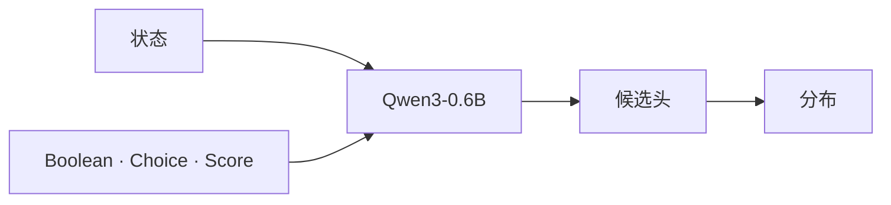

<p align="center">
  
</p>

<p align="center">
  <a href="README.md"></a>
  <a href="LICENSE"></a>
  <a href="https://huggingface.co/aimeigaoshou/agent-jev"></a>
  <a href="https://huggingface.co/Qwen/Qwen3-0.6B"></a>
  <a href="https://huggingface.co/datasets/LocalLLaMA/typed-decisions"></a>
  
</p>

<p align="center">
  权重：<a href="https://huggingface.co/aimeigaoshou/agent-jev">https://huggingface.co/aimeigaoshou/agent-jev</a>
</p>

<p align="center">
  <a href="#它做什么">它做什么</a>
  &nbsp;&nbsp;·&nbsp;&nbsp;
  <a href="#三种原语">原语</a>
  &nbsp;&nbsp;·&nbsp;&nbsp;
  <a href="#一次前向">一次前向</a>
  &nbsp;&nbsp;·&nbsp;&nbsp;
  <a href="#typed-decisions">结果</a>
  &nbsp;&nbsp;·&nbsp;&nbsp;
  <a href="#时延与吞吐">时延</a>
  &nbsp;&nbsp;·&nbsp;&nbsp;
  <a href="#跑起来">跑起来</a>
  &nbsp;&nbsp;·&nbsp;&nbsp;
  <a href="#http">HTTP</a>
  &nbsp;&nbsp;·&nbsp;&nbsp;
  <a href="#仓库">仓库</a>
</p>

AgentJev-0.6B 不写句子。你给它一段状态，和已经写好的问题。一次前向返回每个选项的概率。解码出的 token 数是 0。

它适合放在 Agent 循环里做门控、路由和评分。解释错误、改代码、起草回复，仍然交给更大的模型。

---

## 它做什么

写代码的 Agent、分派工单的机器人、工作流引擎，大部分步骤其实不是写作题。测试过了没有。下一步调哪个工具。这条命令能不能执行。常见做法是让 27B–70B 的模型把一个布尔值说成一段话，再去解析这段话。

| | 拿写作者当开关 | AgentJev |
| --- | --- | --- |
| 输出 | 你希望它是 JSON 的文本 | 你给定选项上的分布 |
| 解码 | 一个 token 接一个 token | 没有 |
| 失败方式 | 格式坏了，或者一句很确定的空话 | 一个可以设阈值的概率 |
| 在循环里的位置 | 占掉一整轮 | 写作者脚下的那一下反射 |

<p align="center">
  
  <br>
  <sub>状态保持非结构化。问题是有类型的。答案是分布。</sub>
</p>

状态可以是 diff、堆栈、工单线程或一张表。对象会按稳定 JSON 送进去。问题的 id 只用来对上响应，不会进入模型。含义必须写在问题和选项正文里。

---

## 三种原语

三种形状。每一种都返回完整分布，不只返回胜出的那一项。

| | Boolean | Choice | Score |
| --- | --- | --- | --- |
| 问的是 | 一个命题 | 就这些选项而言，选哪一个 | 落在这条有序量尺的哪里 |
| 你传入 | 可选的 true / false 准则 | 2–255 个选项，每项一段描述，列表或映射都可以 | 2–10 级描述，从低到高 |
| 你拿回 | `value`、为真的概率、两侧质量 | `value`、`top_probability`、`margin`、完整分布 | `level`（最大概率的下标），`score` = Σ i · Pᵢ |

`margin` 是第一名和第二名的差。Choice 是给定集合内部的相对偏好，不是这个动作独立的成功概率。若要后者，对每个动作单独问一个 Boolean，再用你自己的结果做校准。

---

## 一次前向

骨干是去掉语言模型头的 Qwen3-0.6B。每个候选项读它最后一个 token 的隐状态。一个与排列等变的小头再给整组打分：选项的书写顺序不会偷偷变成名次。Softmax 按问题做。



三件事是实现，不是口号。

**没有解码。** 隐状态直接变成 logits。没有输出词表这一步，也就没有待修补的 JSON。

**上下文 2,048 tokens。超长会拒绝，不会静默截断。** 装不下的 diff 或堆栈是一次错误，不会悄悄切掉问题或某个候选项。

**同一问题的候选共享前缀。** 在一份固定负载上——64 个 Choice 选项加 1 个 Boolean，共 66 条路径、33,547 个路径 token——不共享时中位数 **609.65 ms**，共享前缀 **298.91 ms**。概率最大绝对差 **0.000508**，选中的选项没有变。两边生成的 token 都是 0。这是这份负载、预热之后的测量，不是对所有输入的承诺。

<p align="center">
  
  <br>
  <sub>状态编码一次。候选项从这条前缀上分出去。</sub>
</p>

不同问题之间还不共享状态缓存。训练代码里留了树编码器的接口。上面测到的是共享前缀这条推理路径，不是那个接口。

---

## Typed Decisions

[Typed Decisions](https://huggingface.co/datasets/LocalLLaMA/typed-decisions) 官方测试集：**400 个案例，2,000 道题**。每个案例一段状态、五道题，四个工作流。准确率是和公开教师分布的最大概率项是否一致，不是 Coding Agent 的真实成功率。

| 模型 | 性质 | Top-1 | 软交叉熵 ↓ | Brier ↓ | ECE ↓ | 等级误差 ↓ |
| --- | --- | ---: | ---: | ---: | ---: | ---: |
| **AgentJev-0.6B，本轮** | 专用模型 | **79.25%** · 1585/2000 | **0.8494** | **0.0448** | 0.1687 | **0.2096** |
| Laya 已发布权重 | 专用模型 | 77.00% · 1540/2000 | 0.8844 | 0.0615 | 0.2170 | 0.2423 |
| TypeSafe Jev 1.13.0 | 通用模型，零样本 | 72.7% | — | 0.148 | 0.144 | 0.391 |
| ModernBERT-base，149M | 专用模型 | 64.6% | — | 0.119 | 0.179 | 0.444 |
| MiniLM-L6，22M | 专用模型 | 58.7% | — | 0.143 | 0.108 | 0.515 |
| AgentJev phase 4，本轮之前 | 专用模型 | 38.70% · 774/2000 | 1.2817 | 0.2577 | 0.1050 | 0.7062 |
| 标签频率 Prior | 参照 | 47.0% | — | 0.189 | 0.088 | — |
| 均匀分布 | 参照 | 30.8% | — | 0.238 | 0.169 | — |

没有软交叉熵的几行，抄自数据集卡片，本仓库没有重测。那张卡片也不公布软交叉熵。这几行的 Brier、ECE、等级误差沿用卡片自己的定义。

相对 Laya，这份测试集上的准确率差是 **+2.25 个百分点**。按 400 个案例做 bootstrap，95% 区间 **[+0.65, +3.90]**。相对本轮的起点 phase 4，差距是 **+40.55 个百分点**，区间 **[+37.35, +43.50]**。

<p align="center">
  
  <br>
  <sub>差距按题数计。合计 1,585 对 1,540。发票 431 对 406。客服 411 对 382。</sub>
</p>

### 按工作流

每个工作流 500 题。AgentJev 用的是校准后的权重。Laya 与上表是同一个已发布专用权重。

| 工作流 | AgentJev | Laya |
| --- | ---: | ---: |
| 发票处理 | **86.20%** | 81.20% |
| 客户服务 | **82.20%** | 76.40% |
| 安全事件 | 76.80% | **77.60%** |
| Agent 轨迹观测 | 71.80% | **72.80%** |

### 按原语

| 原语 | 题数 | Top-1 | 软交叉熵 |
| --- | ---: | ---: | ---: |
| Boolean | 600 | 88.83% | 0.4935 |
| Choice | 600 | 75.33% | 0.9767 |
| Score | 800 | 75.00% | 1.0209 |

### 这张表怎么读

专用模型和通用模型不是同一种测量。数据集卡片写了这一点，表里也标了。Jev 1.13.0 是零样本答这些题。AgentJev、Laya、ModernBERT、MiniLM 都在这个基准上拟合过。

Laya 已发布权重用了全部 1,200 个官方训练案例。本轮留出 120 个开发案例和 120 个校准案例，按开发集软交叉熵选出第 600 步，**然后**才打开测试集。温度是每种原语一个正标量，只在校准集上拟合。损失是软交叉熵加上 0.1 倍的候选求和 Brier。种子 `20260921`。数据版本 `ea9306458d6e9563628369a3d1e72e362fb381d2`。

标签是教师分布，里面有合成案例。在这里赢下一行，不等于拉取请求合并了、事件被遏制了、或者发票付出去了。

完整数字：[`typed_decisions/comparison.json`](typed_decisions/comparison.json)、[`typed_decisions/protocol.json`](typed_decisions/protocol.json)、[`typed_decisions/REPORT_zh.md`](typed_decisions/REPORT_zh.md)。

---

## 时延与吞吐

相对 Laya，二者的权衡很清晰：短输入单题 Laya 更小更轻；多候选负载 AgentJev 凭借共享前缀扩展性更好。

| 负载条件 | Laya（421M，ModernBERT） | AgentJev（598M，Qwen3） | 差异与成因 |
|---|---:|---:|---|
| **测试集单案 P50**（1 段状态 5 道题） | **41.53 ms** | ~60–70 ms | 极短文本上 Laya 快约 20 ms；参数量比 Qwen3 少 1.77 亿 |
| **测试集单案 P90**（1 段状态 5 道题） | **47.14 ms** | ~85 ms | 均处于交互式决策预算内 |
| **多候选重负载**（64 个 Choice + 1 个 Boolean，3.3 万 token） | 约 500–600 ms *(重复前向)* | **298.91 ms** *(共享前缀)* | **AgentJev 快约 2 倍**，来自前缀 KV 复用 |
| **上下文上限** | 1,024 tokens | **2,048 tokens** | Laya 超过 1,024 会截断或报错；AgentJev 容纳两倍状态 |

Laya 的 ModernBERT 是双向编码器，没有因果前缀缝隙：64 个选项的同一问题需要对状态文本重复做 64 次前向。AgentJev 将提示前缀的 KV 缓存一次，所有候选项分支挂在同一上下文下并行打分，冗余骨干 token 计算从 33,547 降到 2,551（**减少 92.4%**）。

<p align="center">
  
  <br>
  <sub>只比较宽候选。短的五题案例上，Laya 更小的编码器仍然更快。</sub>
</p>

---

## 跑起来

v1 权重是 [不可变 v1 修订版](https://huggingface.co/aimeigaoshou/agent-jev/tree/7d433994fbde17a3f0993c2f2b02fe8ca1370db1)上的 safetensors 状态字典。这个 git 仓库是代码。服务要的是 torch checkpoint，所以先包一层。安装项目依赖前，请通过 [PyTorch 官方选择器](https://pytorch.org/get-started/locally/)安装适合硬件的 PyTorch；`requirements.txt` 要求 `torch>=2.0.0`。

```bash
git clone https://github.com/malevrigns/agent-jev.git
cd agent-jev
python -m venv .venv
pip install -r requirements.txt
pip install huggingface_hub safetensors
```

```python
from huggingface_hub import hf_hub_download
from safetensors.torch import load_file
import torch

V1_REVISION = "7d433994fbde17a3f0993c2f2b02fe8ca1370db1"
src = hf_hub_download("aimeigaoshou/agent-jev", "model.safetensors", revision=V1_REVISION)
torch.save({"state_dict": load_file(src)}, "agentjev_v1.pt")
hf_hub_download("aimeigaoshou/agent-jev", "temperatures.json", revision=V1_REVISION, local_dir=".")
```

```bash
python -m jev_service.server \
  --checkpoint agentjev_v1.pt \
  --model-path Qwen/Qwen3-0.6B \
  --temperatures temperatures.json \
  --port 8149
```

`model.safetensors` 是完整模块：骨干加上候选头。它不是因果语言模型，`AutoModelForCausalLM` 加载不了。`AgentJevModel` 先搭好 Qwen3 骨架，再用 `load_state_dict(..., strict=True)` 盖掉。公开张量是 float32；加载模型时保持 `dtype=torch.float32`（默认值）以匹配张量。

进程只绑 **127.0.0.1**。工作台在 [http://127.0.0.1:8149/](http://127.0.0.1:8149/)。`GET /health` 和 `GET /api/info` 返回当前加载的权重。上表对应的是第 600 步选出的 checkpoint。这次公开的张量就是那一轮。

`--temperatures` 传入在留出校准集上拟合的标量。`--page` 替换工作台页面。`--device` 默认 `cuda:0`。`--max-tokens` 默认 2048。

---

## 客户端

`agentjev_client.py` 对这个服务说话。除标准库外没有额外依赖。

```python
from agentjev_client import AgentJev

jev = AgentJev("http://127.0.0.1:8149")

state = {
    "task": "修复 UserAuthService.verifyToken 的空指针",
    "test_output": "Tests run: 14, Failures: 1 — test_expired_token",
}

gate = jev.decide_boolean(
    state,
    "测试是否已经全部通过？",
    criteria={
        "true": "测试全绿，并且项目可以构建。",
        "false": "仍有失败的测试。",
    },
)

route = jev.decide_choice(
    state,
    "Agent 下一步应该做什么？",
    options={
        "read_failed_test": "打开 test_expired_token，读断言。",
        "rewrite_file": "让更大的模型重写这个服务。",
        "commit": "不管失败，提交当前 diff。",
        "retry": "不改代码，把测试再跑一遍。",
    },
)

risk = jev.score(
    state,
    "这次改动的运行风险在哪一级？",
    levels=[
        "隔离修改，没有外部行为变化。",
        "一条单元断言挪动了。",
        "公开签名变了。",
        "鉴权行为可能被绕过。",
    ],
)
```

`gate` 里有 `decision`、`prob_true`、`prob_false`、`confidence`、`wall_ms`。
`route` 里有 `best_action`、`probability`、`margin`、`distribution`。
`risk` 里有 `level` 和 `expected_score`。

同一段状态要问好几题时，用 `evaluate(state, questions)`。多段状态放在 HTTP 体的 `requests` 里，最多 32 段。

下面三个脚本假定 8149 上已经有服务：

```bash
python run_practical_test.py
python test_coding_scenarios.py
python test_game_suite.py
```

前两个走软件工程场景。第三个走客服、迷宫、贪吃蛇和 ViZDoom 形态的决策。它们是对着活服务的演示，不是离线单测。

---

## HTTP

`POST /api/evaluate`

```json
{
  "state": "23 个测试通过，1 个失败。",
  "questions": [
    {
      "id": "done",
      "type": "boolean",
      "question": "测试是否已经全部通过？",
      "criteria": {
        "true": "测试全绿。",
        "false": "至少有一个测试失败。"
      }
    },
    {
      "id": "next",
      "type": "choice",
      "question": "下一步做什么更有用？",
      "options": {
        "debug_failure": "读失败的断言。",
        "submit_patch": "现在就开拉取请求。"
      }
    }
  ]
}
```

```json
{
  "api_version": "agentjev.decision.v1",
  "results": [
    {
      "id": "0",
      "answers": [
        {
          "id": "done",
          "type": "boolean",
          "probability": 0.08,
          "value": false,
          "distribution": { "true": 0.08, "false": 0.92 }
        },
        {
          "id": "next",
          "type": "choice",
          "value": "debug_failure",
          "top_probability": 0.87,
          "margin": 0.74,
          "distribution": { "debug_failure": 0.87, "submit_patch": 0.13 }
        }
      ]
    }
  ],
  "usage": { "generated_tokens": 0 }
}
```

上面的概率只说明字段形状。Score 的答案会多出 `score`、`level` 和 `legend`。批量写成 `{"requests": [{"id", "state", "questions"}, ...]}`。单次上限：32 段状态、128 道题、1,024 条候选路径，请求体 1 到 1,000,000 字节。同一题里的候选描述不能重复。

---

## 工具前面的一道门

`agentjev_hook.py` 是 Claude Code 的 `PreToolUse` 命令钩子，覆盖 Bash、Write、Edit。它把工具载荷发到 `http://127.0.0.1:8149/api/evaluate`，问一个 Boolean 和一个四级 Score，再打印决定。

只有评分到第 3 级 **并且** Boolean 认为不安全时，才会拦住。服务没有应答时钩子以 0 退出，工具继续执行。把钩子指到这个脚本，服务保持在 8149。地址写死在文件里。

<p align="center">
  
  <br>
  <sub>钩子判断这一次调用。它不代替那个写补丁的 Agent。</sub>
</p>

`assets/decision_arena.html` 可以在浏览器里直接打开，它是静态页面。8149 上的页面才是绑在当前权重上的工作台。

---

## 留出了什么

训练案例和 400 个测试案例按案例 id 切开。一个案例的所有问题留在同一个分割里。factors、金标和案例 id 都不进入模型输入。测试集没有参与选 checkpoint，也没有参与拟合温度。

这是这个基准上的卫生，不是对其他数据集的声明。

---

## 仓库

| 路径 | 是什么 |
| --- | --- |
| `agentjev/` | 骨干、候选头、损失、训练入口 |
| `jev_service/` | 本机服务、契约、前缀运行时、工作台 |
| `agentjev_client.py` | Python 客户端 |
| `agentjev_hook.py` | PreToolUse 门控 |
| `typed_decisions/` | 协议、对照数字、逐题预测 |
| `assets/` | 头图、动图、静态页面 |
| `run_practical_test.py`、`test_coding_scenarios.py`、`test_game_suite.py` | 对着活服务的演示 |

服务侧容易漏掉的说明在 [`jev_service/README.md`](jev_service/README.md)。

---

## 引用

```bibtex
@misc{agentjev2026,
  title        = {AgentJev: A 0.6B System One Decision Model},
  author       = {malevrigns},
  year         = {2026},
  howpublished = {\url{https://github.com/malevrigns/agent-jev}},
  license      = {Apache-2.0}
}
```

## 社区

- [Linux.Do](https://linux.do/) — 本项目非常认可 LinuxDo 社区！

Apache-2.0。见 [LICENSE](LICENSE)。
